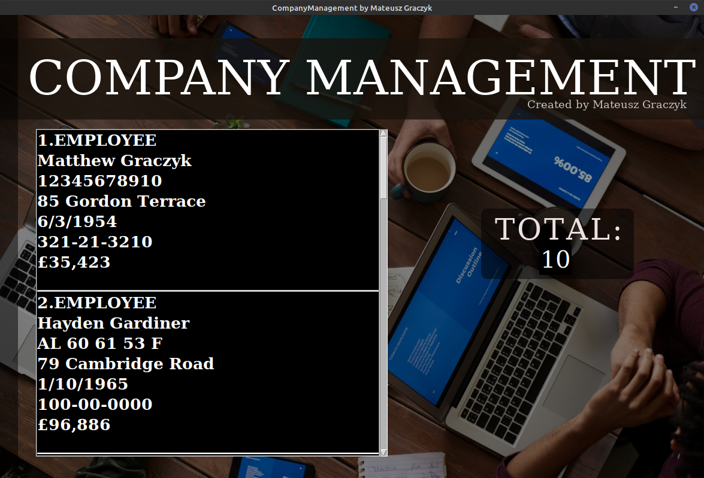
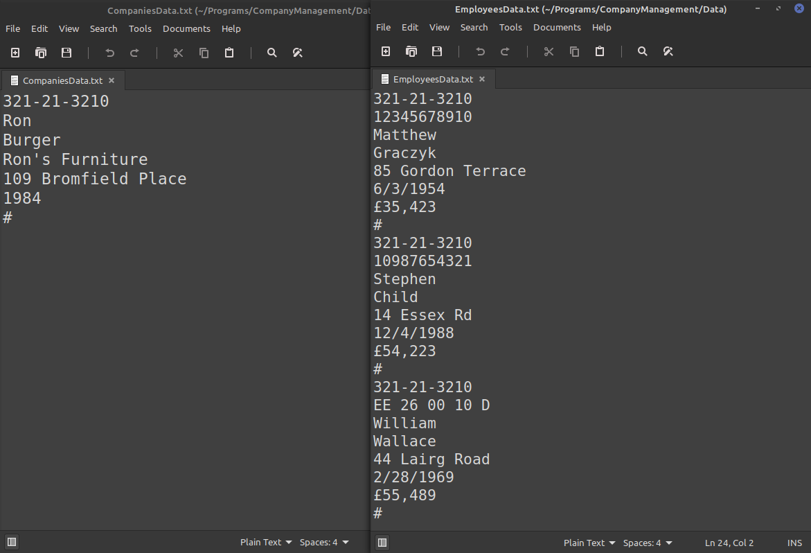
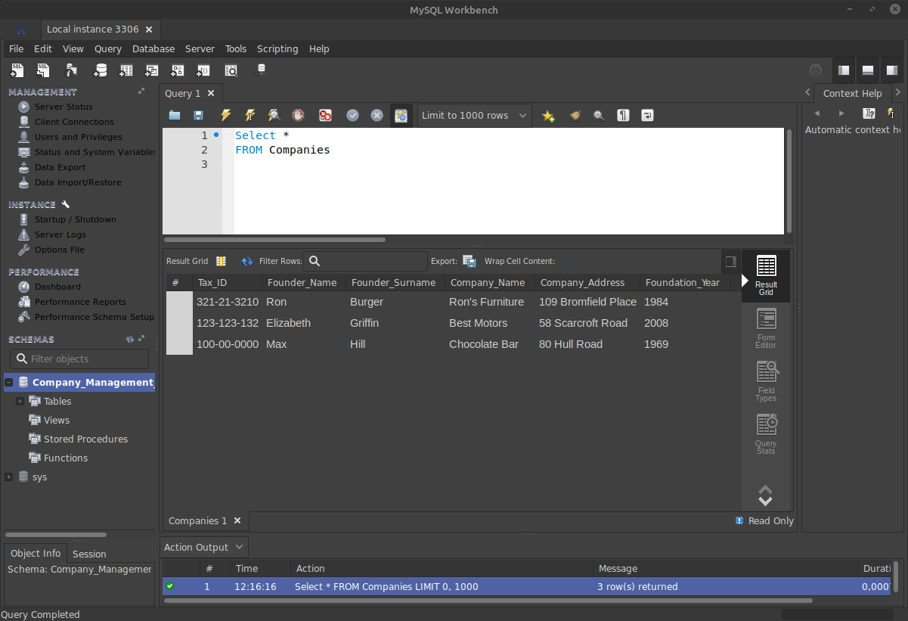
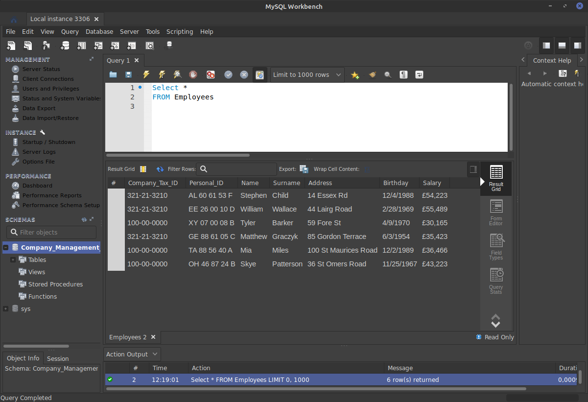

# CompanyManagement
Hello everyone!
I would like to introduce to you my own 'CompanyManagement' project. I wrote this for two months and it finally finished. It was written in Python with the Tkinter library. We can use it, as the name suggests, to manage the companies and employees. All data will be sorted in a local database (txt file), but we can also send it to the server and ofcourse download from the server. More inforamtions and pictures you can see below:

*MENU*
- Here we have all the ways to manage our companies.
- The buttons turn blue. 
- Tips selection

--------------------------------------------------------------------------------------------------------------------

*ADD EMPLOYEE*
- Company Tax ID must exists.
- In one company can be only one employee with the same Personal ID.
- One employee can work in several companies.
- All spaces must be not empty.
- Success/Allready Exists/Failed only takes a couple of seconds.
- Tip works

--------------------------------------------------------------------------------------------------------------------

*ADD COMPANY*
- Company Tax ID must not exists.
- All spaces must be not empty.

--------------------------------------------------------------------------------------------------------------------
*DELETE EMPLOYEE*
- Two elements must be correct.
- The same is for companies (there only Company Tax ID must be correct).

--------------------------------------------------------------------------------------------------------------------

*EMPLOYEES LIST*
- Here we have employees from all companies.
- Total number of employees
- The same is for companies.

--------------------------------------------------------------------------------------------------------------------

*FIND EMPLOYEE*
- Only first space must be correct.
- Second is optional.
- That's tips work.
- The same is for companies (there only Company Tax ID must be correct).

--------------------------------------------------------------------------------------------------------------------

*TXT DATABASE*
- Txt database is always loaded when starting the program.
- The database is changed regulary when the program is working.

--------------------------------------------------------------------------------------------------------------------

*SEND/DOWNLOAD COMPANIES AND EMPLOYEES TO/FROM SERVER*
- Everything must be correct.
- When we download database from the server, our txt database will be changed. In the opposite direction it works too.

--------------------------------------------------------------------------------------------------------------------
